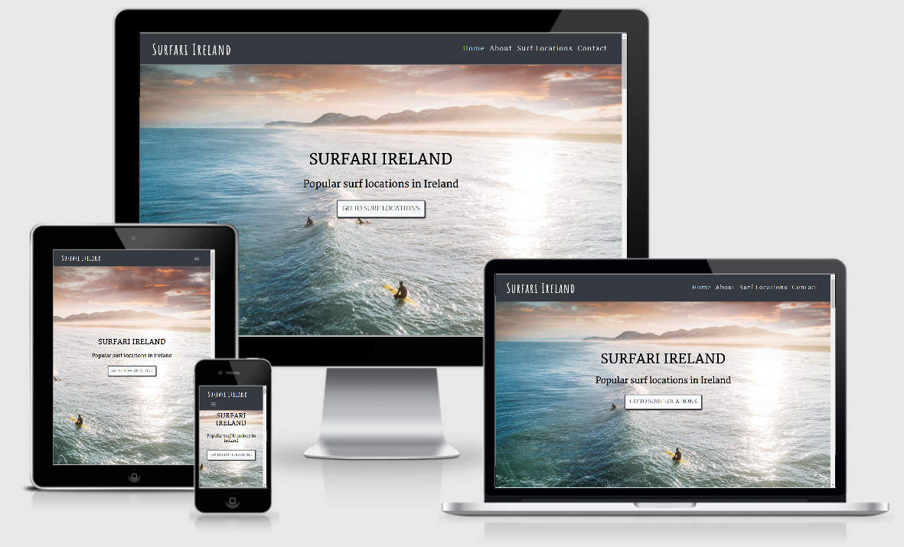
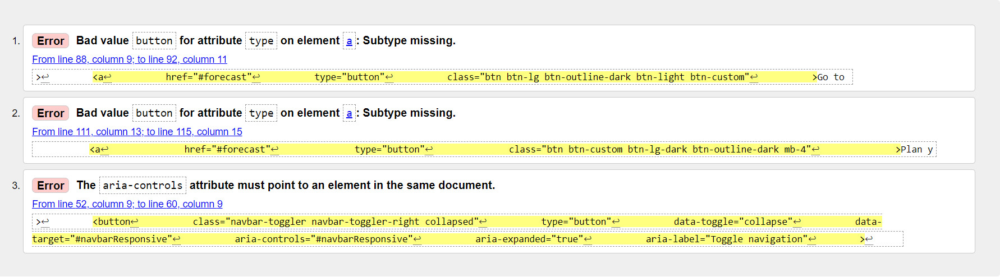

# Surfari Ireland

[GitHub Pages Live Site](https://craig-ryan.github.io/Surfari-Ireland-MS2/index.html/)

<h2>Overview</h2>
This project's aim is to provide an interactive website that allows users to search through various surfing locations around Ireland as well as information relating to nearby surf schools, rentals and/or accommodation. 

## Table of contents:
> - [UX](#ux)
> - [User Stories](#user-stories)
> - [Features](#features)
> - [Existing Features](#existing-features)
> - [Features Left to Implement](#features-left-to-implement)
> - [Technologies Used](#technologies-used)
> - [Testing](#testing)
> - [Deployment](#deployment)
> - [Credits](#credits)
> - [Content](#content)   
> - [Media](#media)  
> - [Acknowledgements](#acknowledgements)  

## UX
This project aims to provide surfers or people interested in learning to surf with current and future surf forecasts for various surf spots in Ireland. Users will be able to navigate through a map with pre-loaded surf spots to check surf quality and nearby points of interest such as surf schools, cafés, accommodation and/or rentals.

### User Stories

> - _"I want to be able to find information regarding surf forecasts for that location"_
> - _"I want to know if there are surf schools, rentals, accommodation and/or places to eat nearby"_
> - _"I want to be able to get in touch to find out any information that isn't made readily available on the site"_
> - _"I want a site that is intuitive and requires minimal navigation to find the information I want"_

### Site Owner Stories

> - _"I want users to be able to easily navigate through the site"_
> - _"I want to give users the opportunity to discover new points of interest for their next surf trip"_
> - _"I want users to be able to contact me if they need further information"_

### Wireframes
A single page landing area was designed for ease of navigation for users across mobile, tablet and desktop screen sizes.
> - [Wireframes](https://github.com/Craig-Ryan/Surfari-Ireland-MS2/blob/master/assets/Wireframes/Milestone%20Project%202%20Wireframes.pdf) - View Wireframes in a separate folder.

## Features

### Existing Features
Navigation: The site is entirely navigable by a fixed navigation bar which contains links to each section of the site. 

Google Maps API: The Google Maps API has been optimized to give users a visual representation of where sites of interest, pinned as markers, included in the page can be found.

EmailJs: EmailJS was added to allow for users to contact the site owner directly and with ease.

### Features Left to Implement

Magic Seaweed API: Unfortunately the API key for the Magicseaweed was unavailable when making this project. If it were available it would have been implemented to give users the ability to see surf forecasts directly within the site.

Info Windows when clicked do not automatically close when another marker is clicked on. Due to inexperience and time constraints I was unable to fix this.

The collapsable navbar on clicking menu items does not close automatically. I did not have the time or ability to amend this.

Dropdowns for surf locations would have been implemented if time permitted.

## Technologies Used
> [HTML5](https://en.wikipedia.org/wiki/HTML5)
>
> [CSS3](https://en.wikipedia.org/wiki/CSS)
>
> [JavaScript](https://en.wikipedia.org/wiki/JavaScript)
>
> [Bootstrap](https://getbootstrap.com/)
>
> [Google Maps API](https://developers.google.com/maps/documentation)
>
> [EmailJS](https://www.emailjs.com/)
>
> [GitHub](https://github.com/)
>
> [GitPod](https://www.gitpod.io/)
>
> [Google Fonts](https://fonts.google.com/)
>
> [Font Awesome](https://fontawesome.com/start)

## Tools Used

> - [Balsamiq](https://balsamiq.com/) - For designing the design of this project.
> - [W3C CSS Validator](https://jigsaw.w3.org/css-validator/) - For designing the desired outcome of this project.
> - [W3C HTML Validator](https://validator.w3.org/nu/#textarea) - For designing the desired outcome of this project.
> - [Amiresponsive](http://ami.responsivedesign.is/#) - For viewing responsiveness across devices..

## Testing 

> - [W3C CSS Validator](https://jigsaw.w3.org/css-validator/)
Ran CSS code through validator. Some minor issues arose relating to preloaded Bootstrap or AOS libraries. Nothing major found and no effects on website itself. Issues were left for now.

> - [W3C HTML Validator](https://validator.w3.org/nu/#textarea)
Ran HTML code through validator. Some minor issues arose relating to preloaded Bootstrap or AOS libraries. Nothing major found and no effects on website itself. Issues were left for now.

### Resources
> - [Global Surfari](https://safaritownsurf.com/shop/books/global-surfari) - Original book and inspiration for this project.
> - [TinyPng](https://tinypng.com/) - Resource for scaling down image sizes to load faster on the site.
> - [YouTube](https://www.youtube.com/) - For additional advice when building this project.
> - [Pexels](https://www.pexels.com/) - For free images when building this project.
> - [Pixabay](https://pixabay.com/) - For free images when building this project.

## Testing

Tested using [Amiresponsive](http://ami.responsivedesign.is/#)across all manners screen sizes from mobile up to large desktop monitors.

Design met expectations across all screen and device widths.

Tested across multiple internet explorers including Chrome, Microsoft Edge, Brave and Ecosia.

Viewed on iPhone X, Samsung A-50 mobile phones as well as iPad Pro.

### Issues Encountered

Menu dropdown responsive navbar does not close after being clicked.

Info Windows in Google Map do not close when a new marker is clicked.

## Deployment

This project used [GitPod](https://www.gitpod.io/) and [GitHub](https://github.com/) for version control. 
A live version of this project can be viewed on [GitHub Pages](https://craig-ryan.github.io/Surfari-Ireland-MS2/index.html) 

To open this project follow these steps:
1. Log in to GitHub and go to my [repository](https://craig-ryan.github.io/Surfari-Ireland-MS2/index.html).
1. Click on settings near the top right of the page and scroll down to the pages section.
1. A live version of the page is inside the green box.
1. Click to open.

## Design 

This project followed a simple design structure. 

The main fonts used were "Matel" & "Amatic SC".

### Colors Used
1. #b2deec for hovered links.
1. #373a40 for background colors in some sections and headings.
1. #000 & #fff for simple text contrast.

## Credits
### Content
Written content within this project was written by me.

### Media
Photos used, other than those from the sites already referenced above are from the locations websites or social media.

[Map Icons Collection](https://mapicons.mapsmarker.com/) provided me with the unique map pins for the Google Maps markers.

### Acknowledgements
A massive thank you to the team at Code Institute for the insightful lessons that lead to this project for being possible.

A special thank you to my mentor, Akshat Garg, for taking the time to help me through the most difficult parts of this project.

The Code Institute Slack Community, as always, were tremendously helpful with any queries I had relating to this project.

As I am an absolute beginner with regards to JavaScript I used this [Tutorial](https://www.youtube.com/watch?v=Zxf1mnP5zcw) by Traversy Media to assist me in implementing the Google Map on this project.  
